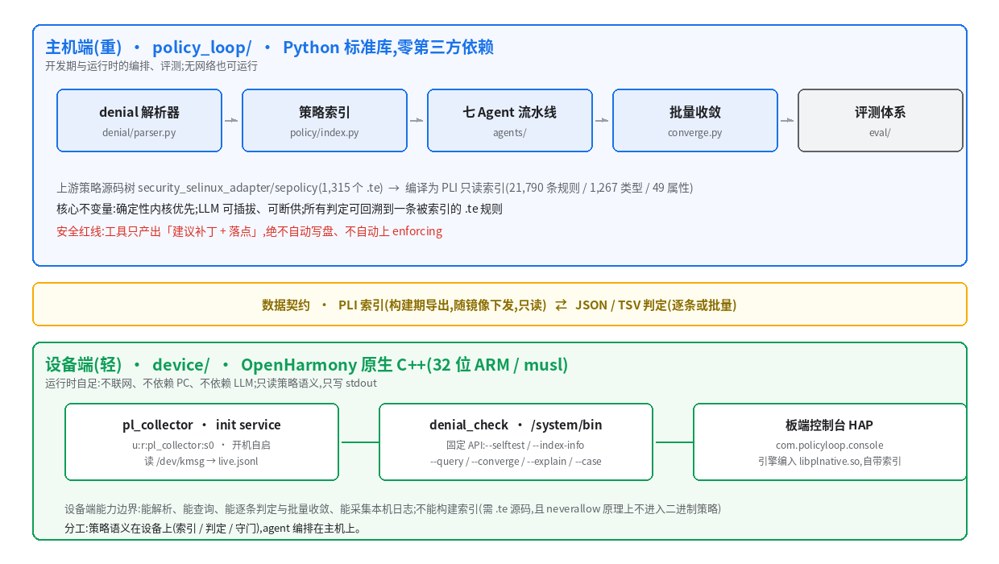
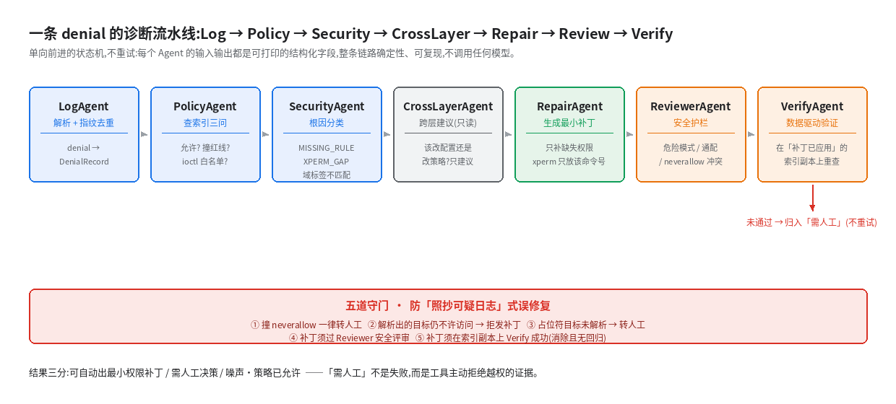
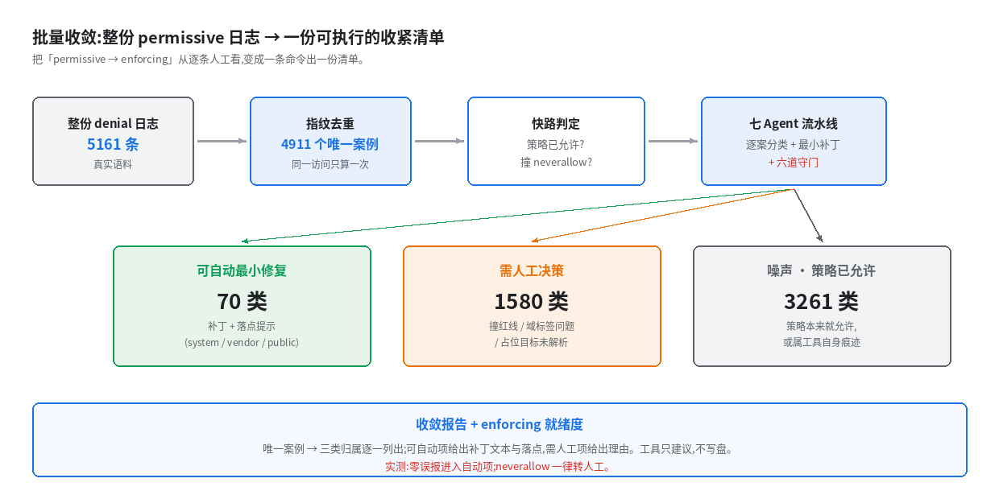
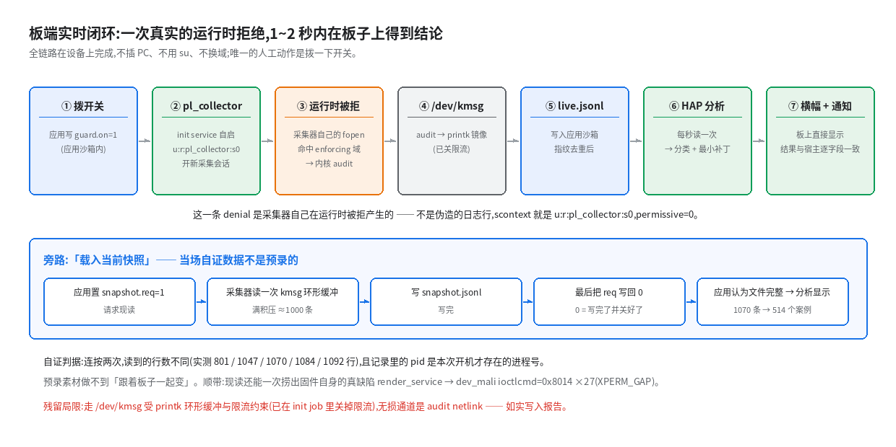

# 2026 开源鸿蒙大学生创新大赛 · 赛道一

**赛题：PolicyLoop —— OpenHarmony SELinux 拒绝日志的最小权限自收敛**

| | |
|---|---|
| 学校名称 | 【待填】 |
| 团队名称 | 【待填】 |
| 队长 | 【待填】 |
| 队员 1 | 【待填】 |
| 队员 2 | 【待填】 |

> 提交材料：① 参赛作品简介（另附）② 本开发设计文档 ③ 项目视频/PPT（另附）④ 可选辅助材料
>
> 文中标注 `🔧 待补` 的位置需要补图或截图；标注 `⚠️ 待确认` 的位置是**数字/事实口径冲突**，提交前必须核对（见文末 §0）。

---

## 目录

- [1 简介](#1-简介)
  - [1.1 背景](#11-背景) · [1.2 目的](#12-目的)
- [2 设计描述](#2-设计描述)
  - [2.1 总体设计](#21-总体设计) · [2.2 实现思路](#22-实现思路)
  - [2.3 系统结构](#23-系统结构) · [2.4 模块功能描述](#24-模块功能描述)
  - [2.5 业务/实现流程说明](#25-业务实现流程说明) · [2.6 接口描述](#26-接口描述)
  - [2.7 UI 设计](#27-ui-设计) · [2.8 实测与验证](#28-实测与验证)
- [3 其他](#3-其他)
  - [3.1 成员分工](#31-成员分工) · [3.2 困难与思考](#32-困难与思考) · [3.3 参考](#33-参考)

---

# 1 简介

## 1.1 背景

OpenHarmony 用 SELinux 做强制访问控制：任何应用或系统服务要访问系统资源，都必须先过这道门禁。请求被拒时，内核会记录一条 `avc: denied` 日志：

```
avc: denied { read } for pid=2208 comm="media_service" path="/dev/video0"
     scontext=u:r:media_service:s0 tcontext=u:object_r:camera_device:s0
     tclass=chr_file permissive=0
```

这条日志对开发者极不友好，原因有三：

1. **读不懂**。`scontext` / `tcontext` / `tclass` / 权限位是一套自成一体的词汇，报错现场通常只看到"功能失败"，看不到"为什么"。
2. **不知道在哪补**。策略规则写在数百个 `.te` 文件里，按子系统分目录；一条 denial 该落到 `system/` 还是 `vendor/`、属于哪个组件，靠经验。
3. **补不对**。最省事的做法是"看到 denial 就加一条 `allow`"，这恰好是安全上最危险的做法——它把一次越权尝试固化成永久授权。

现实中的应对往往是**把门禁关成"只记不拦"（permissive）**：系统看起来正常了，但实际处于**无强制拦截**状态。这不是配置问题，而是一个长期悬置的安全债。

这个问题在 OpenHarmony 上游有充分的数据佐证。我们对上游策略仓库 `security_selinux_adapter/sepolicy` 做了一次全量统计（`python -m policy_loop.eval.corpus`）：

| 项 | 实测值 |
|---|---|
| `.te` 策略文件 | **1,315** 个 |
| 策略源码行数 | 51,427 行 |
| 含 denial 注释的文件 | 378 个 |
| 历史 `avc: denied` 注释条目 | **5,230** 条 |
| 索引出的规则 | **21,790** 条 |

也就是说：**光是上游自己的代码注释里，就埋着 5,161 条真实发生过的 denial**（去重后的可解析条目）。这些 denial 分布在全系统各子系统中，每一条当初都被人手工诊断过。这个规模说明：这不是偶发问题，而是一条长期存在、靠人力堆砌的工作流。

## 1.2 目的

本作品的目标是把上面这条工作流自动化，并且**把"安全"作为一等约束而非事后检查**：

> 输入一份 `avc: denied` 日志，自动**读懂 → 定位根因 → 生成最小权限修复 → 安全评审 → 数据驱动验证**，最终支撑把设备从 permissive 收紧到 enforcing。

与"看到 denial 就加 allow"的常见做法相比，本作品要回答的是同一个问题的**更严格版本**：

| 常见做法 | 本作品的目标 |
|---|---|
| 这条访问要放行吗？ | 这条访问**该不该**放行？（撞系统红线的一律拒绝自动放权） |
| 加哪条规则？ | **最小**的那条规则是什么？多一个权限位都算失败 |
| 加完就行了吗？ | 加完之后 denial 消失了吗？有没有引入新的越权？ |
| 一条一条看 | 整份日志一次收敛成可执行清单 |
| 拿不准的就写"转人工" | 转人工之后呢？1,580 条**逐条归因**"该谁修"（实测真正要打补丁的只有 **0** 条） |

**验收目标是可量化的**，对应四组指标：策略覆盖率、补丁最小性、零越权（撞 neverallow 一律拒绝）、以及真机 enforcing 下的端到端一致性。

---

# 2 设计描述

## 2.1 总体设计

作品按"能独立验证"划分成四层，每层都有明确的产出物与验收方式：

| 层 | 内容 | 产出物 | 验收 |
|---|---|---|---|
| L1 确定性内核 | denial 解析器 + `.te` 策略索引 | `policy_loop/denial`、`policy_loop/policy` | 解析/查询差分逐字节一致 |
| L2 评测基线 | 从上游真实语料构造 golden 集并回放 | `data/eval/golden.jsonl`、`docs/eval-L2.md` | 覆盖率、可复现命令 |
| L3 诊断流水线 | 六 Agent 最小权限流水线 + 批量收敛 + 补丁最小化/归因 | `policy_loop/agents`、`converge.py`、`minimize.py`、`attribution.py` | 留一法回归、零过宽、闭环反验 |
| L4 设备端 | 系统组件 `denial_check` + 采集服务 + 控制台 | `device/`、板端 HAP | 真机五项门禁 |

四层的关系是**同一份判定逻辑的三次落地**：先在 Python 上把语义做对（L1–L3），再用评测证明它收敛（L2/L3），最后把它变成设备上的原生系统组件并用差分证明两端等价（L4）。

> 🔧 **待补图**：作品总体功能框图（可直接用图 1，见 2.3.1）。

## 2.2 实现思路

### 原则一：确定性内核优先，LLM 可插拔、可断供

解析、索引、根因分类、最小补丁、安全评审、验证——**全部是纯规则、纯标准库实现**，每个判定都能回溯到一条被索引的 `.te` 规则。LLM 只在配置了 key 时参与"人话解释/候选草稿"，**不参与任何安全决策**。

这个选择有直接的实验依据。我们对同一批真实 denial 做了对照（`docs/eval-llm-guardrail.md`）：

| 方案 | 过宽（越权加权限）率 |
|---|---|
| 未受约束的"AI 直接放权"（naive 档，120 样本） | **100%** |
| PolicyLoop：最小权限指令 + 规则护栏 + 确定性精修 | **0%**（120/120 被拦截并精修回最小） |

结论很直接：**越权倾向是 LLM 的默认行为，不能靠提示词消除，只能靠确定性护栏兜住**。因此架构上把"生成候选"和"批准授权"分成两个角色，后者永远是规则。

### 原则二：绝不自动写盘

工具只产出「建议补丁 + 落点提示（`system/` / `vendor/` / `public/`）」。是否写入 `.te`、是否重建策略、是否上 enforcing，由人决定。这条原则贯穿主机端与设备端——设备端的 `--explain` / `--case` 也只输出建议。

### 原则三：先仿真、后真机

先用上游真实策略语料做数据仿真与量化评测（成本低、可反复），再上真机拿最硬的证据。真机不是"演示道具"，而是**独立于评测构造的第三种证据**。

### 原则四：设备端只搬"属于设备的那一段"

这是本项目最重要的一个架构判断，也是最容易被问到的：**为什么不把整个 PolicyLoop 移植到设备上？**

答案不是"还没搬"，而是**其中一部分原理上搬不过去**：

- **设备上没有策略源码。** 实测设备上 SELinux 的全部家当是 `config`（enforcing）+ 编译后的二进制 `policy.31`（424,699 B）+ 若干 `*_contexts` 文本；`find /system /vendor -name "*.te"` **为空**。
- **`neverallow` 原理上不在二进制策略里。** `neverallow` 是**编译期断言**。`third_party/selinux/libsepol/src/expand.c:2736` 的注释写明：neverallow 规则不写进产出的策略，只在编译期留给断言检查器核对。而本工具最关键的一道守门恰恰是"撞 neverallow → 拒绝自动放权"（策略里实测 392 条 `neverallow` + 10 条 `neverallowxperm`）。设备上拿不到红线，工具会退化成"看到 denial 就建议放权"——正是它最该避免的行为。
- **多智能体编排与评测工具本就属于开发期**，不是运行时设备功能。

因此分工明确：**策略语义在设备上**（索引 / 判定 / 守门），**agent 编排在主机上**。索引由构建期从源码树导出为只读的 PLI 数据文件随镜像下发。这是架构约束，不是偷懒。

## 2.3 系统结构

### 2.3.1 模块划分



系统分为**主机端（重）**与**设备端（轻）**两侧，中间是一条窄接口：

- **主机端**（Python 标准库，零第三方依赖）：denial 解析器、策略索引、六 Agent 诊断流水线、批量收敛、评测体系。
- **设备端**（OpenHarmony 原生 C++，32 位 ARM / musl）：采集服务 `pl_collector`、系统组件 `denial_check`、板端控制台 HAP。
- **数据契约**：PLI 只读索引（构建期导出、随镜像下发）+ JSON/TSV 判定结果（逐条或批量）。

分层依据是**"哪些能力必须和设备在一起"**：只有需要读内核日志、需要独立于 PC 运行的部分才下沉；策略语义（索引 + 判定 + 守门）下沉是因为"设备自己的策略缺口是它自己的事实"；而索引的**构建**不能下沉，因为需要 `.te` 源码。

> 备选方案及为何未采纳：① 全部做成上位机工具——满足不了"系统组件"的定位，也无法在无 PC 的现场使用；② 全部下沉到设备——受制于 neverallow 不在二进制策略中的硬约束，且会把开发期工具塞进系统镜像。

### 2.3.2 系统架构说明

一条 denial 在系统中的完整动线是**六步状态机**：



`Orchestrator` 是一个严格状态机：`Log → Policy → Security → Repair → Review → Verify`。每个 Agent 的输入输出都是可打印的结构化字段（`SecurityCase` 记录全程 trace），因此整条链路可复现、可单测。`VerifyAgent` 验证失败或发现安全回归时，会**回退**到 `RepairAgent` 重算，而不是直接放行。

业务处理上，主机端与设备端共享同一套判定语义：设备端的 `--converge`（批量报告）与 `--case`（逐条判定）**走同一份判定代码**（`ExplainCase` + `ApplyGuards`），因此两条路径的答案不会漂——这一点由差分门禁逐字段验证（见 2.8）。

### 2.3.3 文件结构

```text
policy_loop/
├── policy_loop/                      主机端引擎（Python 标准库，零第三方依赖）
│   ├── denial/parser.py              AVC denial 解析 + 指纹去重
│   ├── policy/
│   │   ├── index.py                  .te 策略索引与查询（allow/neverallow/allowxperm）
│   │   ├── cross_layer.py            应用层 APL 跨层反查
│   │   ├── cil.py                    板子 policy.31 反编译 CIL 的只读视图
│   │   └── sehap.py                  sehap_contexts 解析
│   ├── agents/                       六 Agent 流水线
│   │   ├── orchestrator.py           严格状态机
│   │   ├── security_case.py          案件档案 + Agent Trace
│   │   ├── log_agent.py / policy_agent.py / security_agent.py
│   │   ├── repair_agent.py / reviewer.py / verify_agent.py
│   │   ├── cross_layer_agent.py      跨层判定（advisory）
│   │   └── providers.py              可插拔 LLM Provider
│   ├── eval/                         评测体系
│   │   ├── corpus.py / extract.py    语料统计 / golden 抽取
│   │   ├── replay.py                 索引覆盖回放
│   │   ├── trust.py                  golden 可信度质检
│   │   └── agent_eval.py / agent_llm_eval.py   留一回归 / LLM 护栏对比
│   ├── export/pli.py + cli.py        PLI 索引导出器
│   ├── converge.py                   批量收敛（整份日志 → 三分清单）
│   ├── minimize.py                   补丁集根因归并 + 闭环反验 + 爆炸半径
│   ├── attribution.py                「需人工」1580 条的根因归因（该谁修）
│   ├── explain.py                    单条诊断
│   └── selfcheck.py                  环境 + 模块 + 冒烟自检
├── webui/server.py                   Web UI（stdlib HTTP server + /api/analyze）
├── device/                           设备端（按 OpenHarmony 源码路径镜像）
│   ├── selinux_adapter/
│   │   ├── framework/policycoreutils/src/pl_*.cpp      核心库（6 个编译单元）
│   │   ├── framework/tools/denial_check/test.cpp       命令行外壳与固定 API
│   │   └── interfaces/policycoreutils/include/pl_*.h   接口（7 个头文件）
│   ├── patches/selinux_adapter-BUILD.gn.patch          对上游 BUILD.gn 的加法
│   ├── selinux_policy/                                 域策略、安装与自检脚本
│   │   ├── pl_collector.cil / denial_check.cil
│   │   ├── build_policy.sh / build_pl_collector.sh
│   │   └── install_service.sh / install_to_board.sh / diag_domain.sh
│   ├── board/                                          板端 init 配置与运维脚本
│   │   ├── policyloop.cfg / policyloop-probe.cfg
│   │   └── pl_guard.sh / pl_domtest.sh
│   ├── pl_console/                  板端控制台 HAP 工程（ArkTS + NAPI，含内置索引）
│   └── install.sh                                      铺回 OH 源码树
├── tools/                            devbuild.sh / build_hap.sh / make_app_icon.py …
├── data/
│   ├── corpus/real_denials.txt       真实 denial 语料（5,161 条）
│   ├── eval/golden.jsonl             自证评测集（3,367 对）
│   ├── eval/golden.trusted.jsonl     质检后干净子集（2,154 对）
│   ├── reports/                      各项评测报告（已入库）
│   └── fixtures/                     测试与演示样例
├── docs/                             设计与评测文档、配图
└── tests/                            306 项单测 + 设备差分门禁 diff_device.py
```

> ✅ **已解决（工程规范）**：板端控制台 HAP 的工程源码原在仓库之外（`~/ohos_audit/pl_console`），评委会 clone 不到这一块。现已镜像进 `device/pl_console/`，`tools/build_hap.sh` 的 `PROJ` 默认指向它，`tests/test_tool_domains_sync.py` 也跟着改回仓内路径（两份工具域清单不一致时该测试会失败）。构建离线可跑，只有签名（需本机 UDID）与装机（需 hdc）依赖板子。

## 2.4 模块功能描述

### 2.4.1 denial 解析器（`policy_loop.denial.parser`）

- **标识**：`policy_loop.denial.parser`
- **类型**：数据解析模块
- **目的**：把内核输出的、面向机器而非面向人的 AVC 日志，转成结构化记录。
- **功能列表**：解析 OH 专有形态（`parameter_service` 的 `parameter=`、`samgr_class` / `hdf_devmgr_class` 的 `service=`/`sid=`、`ioctlcmd=0x…`、`permissive` 标志、`audit:`/`avc_audit_slow:` 前缀、续行、多事件切分）；计算**指纹**用于跨批次去重。
- **处理**：纯正则 + 状态机，无外部依赖。`permissive` 按**三态**建模——`0` = 已拦截、`1` = 只记不拦、**其余取值与字段缺失一律为「未知」**。三态在计数上分开（`permissive_unknown` 独立统计），在收敛判定上则**一律走保守侧**：只有 `1` 会被判为历史噪声，未知态与 `0` 同样转人工复核（`DOMAIN_OR_LABEL_MISMATCH`），**绝不参与自动放权**。指纹去重是批量收敛的基础——它让"同一访问重复被拒上千次"收敛成一个案例，也让真机验收指标**天然免疫 printk 丢帧**（见 3.2）。

### 2.4.2 策略索引（`policy_loop.policy.index`）

- **标识**：`policy_loop.policy.index`
- **类型**：策略语义模块
- **目的**：在主机上把 `.te` 源码树编译成可查询的索引；在设备上加载同一份索引的只读投影（PLI）。
- **功能列表**：解析 `allow` / `allowxperm` / `neverallow` / `neverallowxperm`；计算 attribute 闭包（含 `typeattribute` 的空格/逗号两种写法）；展开宏（`binder_call()` 等）与条件块（`debug_only()` 等）；ioctl 白名单/xperm 语义判定。
- **处理**：查询接口三个——`has_access`（请求权限是否**全部**被授予）、`neverallow_rules`（红线）、`ioctl_allowed`（白名单判定）。另有 `resolve_logical_target`：把 `default_service` / `default_hdf_service` 这类**占位目标**按具名服务或自注册 `add` 确定性映射到 `sa_*` / `hdf_*` 具体类型。

实测索引规模（上游 1,315 个 `.te`）：**21,790 条规则、1,267 个类型、49 个属性**，其中 `allow` 20,754、`neverallow` 392、`allowxperm` 634、`neverallowxperm` 10，另有 647 条语句因宏/条件块被跳过。

### 2.4.3 六 Agent 诊断流水线（`policy_loop.agents`）

- **标识**：`policy_loop.agents`
- **类型**：业务编排模块（确定性，无模型调用）
- **目的**：对**一条** denial 给出完整结论：根因是什么、策略红线在哪、最小补丁是什么、能不能自动落地。
- **功能列表 / 处理**：

| Agent | 职责 | 判定输出 |
|---|---|---|
| LogAgent | 解析、指纹去重 | `DenialRecord` |
| PolicyAgent | 查索引三问：允许？撞红线？ioctl 白名单？ | 策略裁决 |
| SecurityAgent | 根因分类 | `MISSING_RULE` / `XPERM_GAP` / `POTENTIAL_ESCALATION` / `NOISE_OR_ALREADY_FIXED` / `DOMAIN_OR_LABEL_MISMATCH` |
| RepairAgent | 生成最小权限补丁 | 普通 `allow` 只补缺失权限；`allowxperm` 只放行该命令号 |
| ReviewerAgent | 安全护栏 | 危险模式 / 越权放行 / 通配 / neverallow 冲突 → APPROVE / REJECT |
| VerifyAgent | 在"补丁已应用"的索引副本上重查 | 消除、无回归、范围最小 → SUCCESS / FAILED / SECURITY_REGRESSION |

- **跨层判定（advisory）**：`CrossLayerAgent` 读取 8 份 `sehap_contexts` 建立 APL 反查，区分"应用域/系统域"，让应用级与系统级的排查链路分开。

### 2.4.4 批量收敛（`policy_loop.converge`）

- **标识**：`policy_loop.converge`
- **类型**：批处理工作流
- **目的**：把"permissive → enforcing"从逐条人工看，变成一条命令出一份清单。
- **功能列表**：整份日志 → 指纹聚类去重 → 快路判定（策略已允许？撞 neverallow？）→ 每唯一案例跑一遍 Agent 流水线 → 输出**收敛报告**（去重比、根因分布、可自动最小修复的补丁集、需人工项、enforcing 就绪度）。
- **处理 —— 五道守门**（防"照抄可疑日志"式误修复）：

| # | 守门 | 作用 |
|---|---|---|
| 1 | 撞 `neverallow` → 直接转人工 | 拒绝自动放权 |
| 2 | 解析出的目标仍不许访问 → 拒发补丁 | 拦住"解析成功但补丁仍写占位符"的情形 |
| 3 | 占位符目标未解析 → 转人工 | 不猜 |
| 4 | 补丁须过 Reviewer 安全评审 | 广度过宽/危险模式拦截 |
| 5 | 补丁须在索引副本上 Verify 成功 | 必须真的消除且无回归 |

> ⚠️ **别把这张表与代码里的 `apply_guards` 混为一谈**，它们是两套分法、数也不同：
> 这里是**流水线里的 5 个拒绝点**（含 Reviewer / Verify），代码里的 `apply_guards`
> 是**另一组 6 个分支**（MLS 级目标 / `default_*` 占位符 / 主体或目标不在语料 /
> 对象类不在语料 / 权限位含非权限名 / 空权限补丁）。后者才是 converge 与 `--explain`
> **共用的那一份**——同一份实现、两个调用点，同一条记录从哪个入口问都必须拿到同一句话
> （见 `eval-converge.md`）。

### 2.4.5 补丁最小化与闭环反验（`policy_loop.minimize`）

- **标识**：`policy_loop.minimize`
- **类型**：批处理后处理（**只在宿主机跑**，不改设备端一个字节）
- **目的**：`converge` 回答的是**逐案例**的问题——"哪一条规则能关掉这一个案例？"
  这对看单个案例的人是对的，对看整份日志的人是错的：两个案例只要内核打印权限的次序
  不同，就会被投影成两条规则，而它们其实是同一个根因。

  ```
  allow init write_updater_exec:file { execute };
  allow init write_updater_exec:file { map };
  allow init write_updater_exec:file { open read };
  ```
  三个 cluster，一个根因：*init 压根不该用这个 updater 二进制*。

- **功能列表**（对应创新点 A / B / F）：
  - **A 根因归并**：重读收敛报告，把同一 `(src, tgt, cls)` 的补丁行并成一条根因规则，
    并记录它**关闭了哪些案例**、是**扩了已有规则**还是**新增**。
  - **B 闭环反验**：把归并后的规则集套回索引的副本上**重新查询**，要求
    "补丁前未解决的案例，套回后全部解决"，且"套回前它们确实没被解决"。
    `converge` 只断言补丁**编译得过**；这一步断言补丁**真的有用**。
  - **F 爆炸半径**：每条规则给出 `BlastRadius` —— 展开后实际受影响的类型数与规则数。
    ⚠️ 判定"最窄规则"必须按**展开后的影响面**，不能按 token 数：
    `{domain}` 只用 1 个 token，却覆盖 **235** 个类型。

- **输出**：`rules`（最小规则集 + 关闭的案例 + 爆炸半径）、`verify`（闭环结论）、
  `--cil`（给 `secilc` 与 neverallow 门禁用）、`--patch-report`（喂给
  `tools/apply_converge.py`，让红线门禁验**归并后**的集合而不是逐案例投影）。
- **实测**：补丁 **69 行 → 54 条根因规则**（归并 10 组、省 15 行；26 条折叠进已有规则，
  其中 3 条会波及属性成员；25 条为新增），闭环反验 **70 未解决 → 0**。

### 2.4.6 策略级根因归因（`policy_loop.attribution`）

- **标识**：`policy_loop.attribution`
- **类型**：批处理后处理（只读，不产生补丁）
- **目的**：`converge` 把 4,911 个唯一案例分成三类，其中 **1,580 个进 `needs_human`**
  ——占三分之一，而它对这些案例说的话只有一句「转人工」。对着一屏"转人工"，读者学到的
  是**工具不知道**，而不是工具知道什么。本模块把那 1,580 条逐条问出根因，
  **判据全部是可证伪的查询**（问板子自己的 `policy.31` 反编译视图、问上游树、
  问日志字段是否完整），不是启发式。
- **每条案例落到一个 owner**——这才是真正交付的东西：

  | owner | 含义 | 实测 |
  |---|---|---|
  | `DEVICE` | 板上真要补权限（**唯一**需要打补丁的一类） | **0** |
  | `TOOL` | 工具侧该修（索引/版本对齐、语料收录） | 342 |
  | `LOG` | 采集/日志质量（缺字段、上下文畸形） | 53 |
  | `HUMAN` | 需要架构决策（撞 neverallow 红线） | 38 |
  | `NONE` | 无需动作（现在已允许） | 1,147 |

- **退出码即判据**：`0` 仅当残留 `UNATTRIBUTED` 为 0——**归因不完备就失败**，
  不许悄悄漏掉。实测 1,580 → 归因 1,580、残留 **0**。
- **主动证伪的三类根因**：板子策略里 `(boolean` 出现 **0** 次、`(constrain` **0** 次、
  `(mlsconstrain` 只有 **1** 条且只约束 `(filesystem (relabelto))`。所以"boolean 未开"、
  "constraint 拦下"、"MLS 级不匹配"在本平台**原理上无从发生**——把它们列进报告当
  "检查过了"是撒谎，本模块选择**写明证伪**。

> **这条结论最反直觉**：1,580 条"转人工"里，真正需要给设备补权限的是 **0** 条；
> 1,147 条是**语料的历史噪声**（日志是上游 `.te` 注释里的旧记录，写下时规则还不存在，
> 后来被补上了），342 条是工具侧要对齐的，53 条是日志质量问题，38 条是架构决策。

### 2.4.7 评测体系（`policy_loop.eval`）

- **标识**：`policy_loop.eval`
- **类型**：开发期验证工具（**不随设备发行**）
- **目的**：让所有结论可量化、可复现、可被质疑。
- **功能列表**：
  - `corpus`：语料规模统计；
  - `extract`：从上游 `.te` 的 `# avc: denied …` 注释与其紧邻修复规则，按邻接配成 `(denial → 真实修复)` 对，产出 golden 集（3,367 对）；
  - `replay`：全量索引下这些真实 denial 是否已被允许——测索引/属性/宏处理的**召回**；
  - `trust`：逐对校验"规则与 denial 是否真的相关"，过滤邻接配对的错配噪声，产出 trusted 干净子集；
  - `agent_eval`：**留一法**回归——剔除某 denial 的修复规则使其回到"未修复"，再跑 Agent 流水线，比对生成补丁；
  - `agent_llm_eval`：同批 denial 上让 LLM 自由起草补丁，量化越权率与护栏拦截率。

### 2.4.8 设备端组件 `denial_check`（`device/`）

- **标识**：`denial_check`，安装于 `/system/bin/denial_check`
- **类型**：OpenHarmony 原生可执行程序（32 位 ARM / musl 动态链接）
- **目的**：**审计设备自己的策略，应该是平台能力，而不是一件必须先有 PC 和串口线才能做的事。**
- **功能列表 / 处理**：
  - 核心是一个**独立静态库** `libdenial_check_core`（6 个编译单元），`external_deps` 为空——即它只能链到 `libc`/`libc++`/`libm`，**不得**引入 hilog 或 libselinux。原因是它的全部意义就在于"在任何能读到输入的域下运行，并把结论写 stdout 而不是写 hilog"。这条规则是**可检查的**，不是声明。
  - 固定 API 入口：`--selftest` / `--index-info` / `--query` / `--dump-denials` / `--converge` / `--explain` / `--case`。
  - `--explain` 另带 `--cross-layer`（显式打开跨层视图，需索引含 `@hap` 段）；不给就只有默认契约。
  - **`--explain` 与批处理走同一份守门**：设备端只有一个 `ApplyGuards`，单条诊断与
    批量收敛调的是它。这一点是**补出来的**——守门原本内联在聚类循环里，于是
    `--explain`（开发者捏着一条坏日志时最先用的那条路）会推荐一条**编译得过、
    Verify 也判成功、只是落不了地**的规则（实例：对着 `default_service` 写
    `allow X default_service:samgr_class { get };`）。同一条记录从哪个入口问，
    现在必须拿到同一句话。
  - **两条路径都进自检**：`--selftest` 内嵌一份 11 条规则的小策略与 26 条 denial，
    比对 24 组收敛向量 + 11 组解释向量（后者按**整份 JSON** 比，其中 6 组 `advisory`
    非空）。两条路径**分别**钉住：把 `--explain` 路径上的 `ApplyGuards` 调用删掉，
    解释向量 6/11 报错而收敛向量 24/24 全绿——收敛向量结构上看不见解释路径，所以
    这不是同一批断言换个写法。六道守门在收敛向量里**一道不缺**。
  - **`@hap` 进索引**：`sehap_contexts` 的 APL↔域桥表随 PLI 下发，设备端才能复现
    跨层结论（"这是 APL 分级边界" vs "这是漏配的规则"）。改动前设备**解析了这张表
    却把它丢掉**：把 17 行 `@hap` 全删掉，设备照样静默装载。
  - **绝不写盘**：只输出建议补丁文本。

### 2.4.9 板端采集服务 `pl_collector`

- **标识**：`pl_collector`，init service（`/system/etc/init/policyloop.cfg`）
- **类型**：系统服务（OpenHarmony init 托管）
- **目的**：让采集不再依赖 PC、`su`、`begetctl`，开机即在。
- **功能列表**：开机自启；运行在**自己的 enforcing 域** `u:r:pl_collector:s0`（无 permissive 兜底）；读 `/dev/kmsg` → 指纹去重 → 写应用沙箱内的 `live.jsonl`；响应控制台的"现读快照"请求。
- **处理**：域策略已 persist 到磁盘，重启仍生效（实测重启后 `up 0 min` 时服务已在域内采集，开机以来本域 denial = 0 条）。

### 2.4.10 板端控制台 HAP

- **标识**：`com.policyloop.console`
- **类型**：OpenHarmony 应用（HAP）
- **目的**：让"设备自己给自己出结论"这件事可见、可演示。
- **功能列表**：开关切换采集会话；每秒读一次 `live.jsonl` 并分析；显示分类 + 最小修复 + 评审/验证结论；系统通知；「载入当前快照」现读 `/dev/kmsg` 现存积压。
- **处理**：**引擎直接编进 `libplnative.so`**，索引编在 HAP 的 rawfile 里——因此**拔掉 USB 也能独立运行**，结果与宿主逐字段一致。

## 2.5 业务/实现流程说明

### 2.5.1 用例 1：单条 denial 的诊断流水线

**参与对象**：`Orchestrator`（状态机）→ 六个 Agent → `PolicyIndex`。

**顺序图**：见 [2.3.2 图 2](#232-系统架构说明)。流程为：

1. `LogAgent` 解析日志行，产出 `DenialRecord` 与指纹；
2. `PolicyAgent` 查索引：该访问当前**是否已被允许**？是否**撞 neverallow**？若是 ioctl，白名单里有没有这个命令号？
3. `SecurityAgent` 依据上一步的裁决做根因分类；
4. `RepairAgent` 生成补丁：普通 `allow` 只补缺失权限，`allowxperm` 只放行该命令号；
5. `ReviewerAgent` 安全评审：广度过宽、危险模式、与红线冲突 → REJECT；
6. `VerifyAgent` 在"补丁已应用"的索引副本上重查：denial 是否消除、有无回归、范围是否最小；
7. 若验证失败 → 回退第 4 步重算。

**典型反例（说明守门的价值）**：设备上有 `render_service → dev_mali:chr_file { ioctl } ioctlcmd=0x8014` 的稳定复发 denial。策略**已经允许了 ioctl 大类**，缺的只是 `allowxperm` 白名单里的**一个命令号**（`XPERM_GAP`）。此时"看到 denial 就加 allow"的工具会建议加一条**已经存在**的规则（写了等于没写），而本作品给出的是：

```
allowxperm render_service dev_mali:chr_file ioctl { 0x8014 };
```

### 2.5.2 用例 2：整份日志的批量收敛



**参与对象**：`converge` → `LogAgent`（去重）→ 快路判定 → 六 Agent 流水线 → 报告。

**实测（本机，2026-10-05 复跑）**：

```
$ python -m policy_loop.converge --log data/corpus/real_denials.txt \
      --policy data/raw/oh-selinux/sepolicy --json /tmp/converge.json
日志 5161 条 → 去重后 4911 个唯一案例（噪声/已允许 3261）。
其中 70 类可自动出最小权限补丁、1580 类需人工决策（占唯一案例约 32%）。
real 0m4.161s
```

根因分布：`DOMAIN_OR_LABEL_MISMATCH` 1,461 / `NOISE_OR_ALREADY_FIXED` 3,261 / `MISSING_RULE` 148 / `POTENTIAL_ESCALATION` 38 / `XPERM_GAP` 3。

**关键观察**：全量 5,161 条里 **零误报**进入自动项；`neverallow` 一律转人工。也就是说，"需人工决策"的 1,580 类**不是工具失败**，而是工具**主动拒绝越权**的证据。

### 2.5.3 用例 3：板端实时闭环演示



**参与对象**：控制台 HAP（应用沙箱）→ `pl_collector`（init service）→ 内核 audit → `/dev/kmsg`。

**动线**：拨一下开关 → 采集器开启新会话 → 它自己的那次 `fopen` 命中 enforcing 域被拒 → 内核 audit → `/dev/kmsg` → `pl_collector` 写入应用沙箱的 `live.jsonl` → HAP 每秒分析 → 横幅 + 系统通知。**全程约 1~2 秒，唯一的人工动作是拨开关。**

关于时延要主动说明（避免被当成卡顿）：拨动 → 采集器轮询到开关 → 首片 500 ms 读取走完 → 才执行那一行受拒操作，所以是 2 秒左右。

**这条 denial 是真的**：它由采集器自己在运行时被拒产生（`scontext=u:r:pl_collector:s0`、`permissive=0`、域为 enforcing），不是伪造的日志行。做成**运行时参数**（`--debug-log <path>`）而非编译期开关，是为了让交付的二进制只此一份，是否触发纯属**部署选择**。

**当场自证（被问"是不是预录的"时）**：应用里有两个来源且各自标注——主按钮「载入当前快照」为**现读**，小字链为**预录样本**。自证判据是"这份文件会变"：连按两次读到**不同的行数**（实测 801 / 1047 / 1070 / 1084 / 1092 行），且记录里的 `pid` 是本次开机才存在的进程号，`<开机微秒>` 与 `/proc/uptime` 对得上。预录素材做不到"跟着板子一起变"。

## 2.6 接口描述

### 2.6.1 调用接口（本系统使用到的周边接口）

| 接口 | 方向 | 说明 |
|---|---|---|
| `/dev/kmsg` | 读 | 内核 audit 记录镜像给 printk 的那份副本；采集服务的输入源 |
| 二进制策略 `policy.31` + `*_contexts` | 读 | 设备上 SELinux 的全部家当；只读，不修改 |
| 上游 `.te` 源码树 | 读 | 主机端构建 PLI 索引的输入（设备上没有） |
| 内核策略装载（CIL） | 写（部署期） | 安装脚本经 `checkpolicy`/`secilc` 把域策略编译并装载 |

### 2.6.2 提供接口（本系统对外提供的接口）

| 接口 | 形态 | 说明 |
|---|---|---|
| **PLI 索引** | 文本数据文件 | 构建期导出、随镜像下发的只读策略投影（含规则、类型、属性、`@hap` 段） |
| `denial_check` CLI | 命令行 | 固定 API：`--selftest` / `--index-info` / `--query` / `--dump-denials` / `--converge` / `--explain` / `--case`（`--explain` 可加 `--cross-layer`） |
| `--case` 逐条判定 | 行式 JSON/TSV | 一行一条已拆好字段的记录进，一行一个 JSON 判定出；**只输出建议，绝不写盘** |
| 收敛报告 | JSON | 字段与宿主引擎逐个相同，可直接 `diff` |
| Web UI | HTTP | `python -m webui.server` 提供 `/api/analyze` 与 Agent Trace 前端 |
| 板端控制台 | HAP | 开关 + 实时视图 + 快照现读 |

## 2.7 UI 设计

作品有两处界面：

1. **主机端 Web UI**（`webui/server.py`，标准库 HTTP server）：单页展示 Agent Trace 动画与结果卡片，输入一条 denial 即可看到六步流水线的可视化过程。
2. **板端控制台 HAP**：顶部开关（切换采集会话）、状态行（`本次窗口 N 行 / 累计 M 个案例`）、案例卡片区（分类 / 最小修复 / `APPROVE · SUCCESS` / 来源标注）、主按钮「载入当前快照」与预录回放链。

**设计原则**：界面必须**如实区分数据来源**——工具造成的 denial 会明确标注「工具造成」，不冒充分析结果；"累计案例"与"本次窗口行数"分开计数，因为它们测的不是一回事。

> 🔧 **待补截图**：① Web UI 的 Agent Trace 界面；② 板端控制台拨开关后的实时结果卡片；③ 板端「载入当前快照」后的状态行（含"已暂停实时刷新"）。

## 2.8 实测与验证

> 本节为模板允许的自主增补章节（2.4 明确"可以根据需要增加或者删除"）。所有数字均可用附录 A 的命令复现。

### 2.8.1 策略索引召回率（L2）

方法：把上游 `.te` 里真实发生过的 denial 拿去问"当前策略允许它吗"，测索引对属性闭包/宏展开/条件块的还原程度。

| 口径 | 样本 | coverage_all | 说明 |
|---|---|---|---|
| 全量 | 5,117 条可评测 | **97.19%** | 含邻接配对的错配噪声 |
| 质检后（trusted） | 3,522 条 | **99.80%** | 干净子集 |
| 质检 + service 占位解析 | 3,522 条 | **99.94%** | 未覆盖仅 2 条（均 `samgr_class`） |

**评测可信度质检**是本项目主动做的一步：`extract` 用"相邻配对"构造 golden，实测 **29.4%（990/3,367）是错配噪声**（一条规则被配去修无关 denial）。`trust` 逐对打可信标签后，所有指标都在干净子集上重跑——**主动把基线从 97.2% 降到 99.8% 的分母上**，而不是拿虚高的数字报成绩。

### 2.8.2 最小权限修复正确性（L3 留一法）

方法：剔除 golden 中该 denial 的真实修复规则，使它回到"未修复"状态，再跑 Agent 流水线并比对生成的补丁。

前置发现：**真实上游策略高度冗余**——剔除单条修复后，多数访问仍被其它规则覆盖。因此只有 **1,915 个 informative 样本**（剔除后确实变为不允许）能真正检验修复能力。

抽样 400（`seed=0`）回放结果：

| 场景 | 结果 |
|---|---|
| 应生成补丁（非 neverallow informative） | **179/179** 全部识别为 `MISSING_RULE` 并生成补丁 |
| 应拒绝放权（撞 neverallow） | **221/221** 全部正确拦截 → 转人工 |

在 179 个生成的补丁上：

| 指标 | 值 |
|---|---|
| `exact_min`（补丁 = 缺失权限，不多不少） | **100%** |
| `sufficient`（修复可消除 denial） | **100%** |
| `overbroad`（比缺失更多） | **0%** |
| `review_approve`（安全评审通过） | **100%** |
| `final_verified`（Verify SUCCESS） | **100%** |

与上游人工修复的对照：**59.2%（106/179）完全一致**；**39.1%（70/179）场景下本作品给出的权限比上游更小**。

> **口径诚实性说明**：`exact_min=100%` 是"补丁 = 剔除后缺失权限"这一构造下的**自洽性验证**，证明的是一致性而非独立金标准的绝对正确率。真正的独立证据是 L4 真机回归。另外，"39% 比上游更窄"需注意：上游 `allow` 聚合修复多条 denial 是**合法**的，不能据此判上游过宽——该数字只表明"单条 denial 视角下本作品未放大权限"。

### 2.8.3 AI 放权的护栏量化

| 方案 | 样本 | 过宽率 | 撞 neverallow | 评审拦截 |
|---|---|---|---|---|
| 确定性规则（基线） | 60 | **0%**（60/60 精确最小） | 0 | — |
| 真实 LLM（明确最小权限指令，deepseek-v4-flash） | 54 有效补丁 | **0%** | 0 | 54/54 通过 |
| 未受约束的"AI 放权"（naive 档） | 120 | **100%** | — | **100% 被拦截并精修回最小** |

结论：**越权倾向是默认行为，护栏把它量化地挡住了。**

### 2.8.4 设备端一致性（L4 五项门禁）

设备端组件声称"和宿主机引擎给出同样的结论"。这个声称只有在被检查过之后才值钱。五项门禁各自证明一件不同的事：

| # | 门禁 | 做法 | 结果 |
|---|---|---|---|
| 1 | `--selftest` | 内嵌固定向量，比对**由宿主 Python 生成并冻结**的 digest 表（不是拿 C++ 自己的输出当答案） | **PASS**：sha1 13 组 + converge 21 组，0 失败（2026-10-09 扩到 converge 24 组 + explain 11 组，见 3.2.2）|
| 2 | `--index-info` | 两端加载同一 PLI，比计数器 | `rules=21824 types=1267 attrs=49 skipped=524 hap_entries=17 hap_domains=13`，与宿主一致 |
| 3 | 报告差分 | 同一份语料两端各出完整 JSON 报告，比 sha256 | **逐字节相同** |
| 4 | 真机采样 | 真读本机 kmsg | `suppressed≈107` 非零，量化了 printk 丢帧 |
| 5 | 查询差分 | **27,912 条**查询，比整个输出体的 sha256 | **2,984,884 B 逐字节相同**（一次覆盖 5 个字段） |

**为什么"2.98 MB 逐字节相同"是有说服力的证据**：两端是**独立实现**（Python vs C++）喂完全相同的输入。这个项目里真实存在的语义陷阱——空 perms 是通配而非空集、xperm 命令是不透明字符串且大小写敏感、`permissive=2` 是三态不是布尔、通配规则命中时未知 perm 名要原样带上——只要错一个，哈希当场炸掉。**我们不是"相信"两端一致，是让它们互相证明。**

**性能**：查询路径原为**按对象类线性扫描**，设备 27,912 条查询 71.25 s（2.55 ms/条，含 297 ms 索引装载），宿主同工作量 40.85 s（1.46 ms/条）。已改为**类型对倒排索引**（`_hit_index` / `pl_index.cpp::BuildCandidates`），并让 clone 继承父索引的 postings 使 ~10 ms 的建表**每棵索引树只做一次**（否则一次 converge 要重建 151 次）。同机 A/B、两侧各用真实实现、输出逐字节相同：**设备查询路径 34×**（0.0987 → 0.0029 ms/条），**宿主判定路径 238×**（1.800 → 0.008 ms/案）。板端 71.25 s 是旧代码在 RK3568 上的实测，按 34× 外推约 2 s —— **外推值，上板后须复测**。

### 2.8.5 板端实时闭环

冷启动实测：`up 0 min` 时服务已在域内采集，**开机以来本域 denial = 0 条**（采集器自身不产生越权）。拨开关后 1~2 秒内控制台给出分类与最小补丁。

### 2.8.6 补丁最小化与归因的实测

两组数字都可由**仓库内命令**复现（见附录 A）。

| 项 | 结果 |
|---|---|
| 补丁行数 | **69 → 54**（归并 10 组、省 15 行） |
| 归并方式 | 26 条折叠进**已有**规则（其中 3 条会波及属性成员）、25 条为新增 |
| 闭环反验 | 补丁前未解决 **70** → 套回后 **0**（`verify.closed = true`） |
| 归因完备性 | 1,580 个人工案例 → 归因 **1,580**、残留 **0**（退出码 0 即判据） |
| 真正待补权限 | owner=`DEVICE` 为 **0** |

**为什么"闭环反验"比"补丁编译得过"强**：`converge` 的 Verify 只保证补丁能编译、且名字级
匹配上"应用后该 denial 消失"；`minimize` 走的是另一条路——把归并后的规则集**套回索引副本
重新查询**，并额外要求"套回**之前**这些案例确实没被解决"。缺了后半句，一个本来就已经
被允许的案例会被算成"补丁的功劳"，那个数字就没有意义。

**归因那一行最反直觉**：1,580 条"转人工"里真正需要给设备补权限的是 **0** 条。
1,147 条是**语料的历史噪声**（这份语料每一行都以 `#` 开头，是上游 `.te` 注释里的旧 denial
记录，不是一次设备采集——写下时规则还不存在，后来被补上了），342 条是工具侧要对齐的
（索引/版本），53 条是日志质量问题，38 条是架构决策（撞 neverallow 红线）。

> ⚠️ 归因里 `DEVICE_LAGS_TREE` 与 `BOARD_SYMBOL_ABSENT` 两档的**数量**随所选上游树变化
> （换成本设备自己的 5.0.3 血脉树，符号缺失会显著变多、版本差会变少）；
> 跨树稳定的是 `DEVICE` 那一档为 0 这个结论。

### 2.8.7 工程自证

| 项 | 值 |
|---|---|
| 单元测试 | **338 通过 / 4 跳过 / 0 失败**（`python -m pytest -q` 收 342 项；`python -m unittest discover -s tests` 运行 302 项）。**CPython 3.12 与 3.13 上结果相同** |
| 自检 | `python -m policy_loop.selfcheck` 全绿 |
| 第三方运行时依赖 | **0**（主机端纯标准库；设备端仅 libc/libc++/libm） |
| 稳定性门 | `tools/stability_gate.py`（逐轮全新子进程）。**同一负载、两个解释器**：3.12.14 → 60 轮 **0 崩溃**；3.13.13 → 60 轮 **6 崩溃（10%）** ⇒ 运行环境钉 **CPython 3.12**，原因与 gdb 回溯见 `docs/known-limitations.md` §7 |

---

# 3 其他

## 3.1 成员分工

| 角色 | 姓名 | 分工 |
|---|---|---|
| 队长 | 【待填】 | 总体方案、确定性内核与六 Agent 流水线、设备端组件、真机验证 |
| 队员 1 | 【待填】 | 【待填：建议按实际分配填写——评测体系 / 文档与演示] |
| 队员 2 | 【待填】 | 【待填】 |

> 说明：本项目为系统底层作品，环境搭建门槛较高（OH 源码树 + 真机 + 交叉工具链）。队友入口文档为 `docs/onboarding.md`（纯新手教程体）。

## 3.2 困难与思考

这一节记录几个**真实踩过、且改变了设计**的坑。它们不是花絮，而是本作品若干架构决定的直接来源。

### 3.2.1 `neverallow` 不在二进制策略里 —— 它决定了设备端的能力边界

最初的设想是"让设备自己从 `policy.31` 反推出全部策略语义"。做了才知道这条路**原理上不通**：`neverallow` 是编译期断言，`libsepol/src/expand.c:2736` 明确写着它不写进产出的策略，只在编译期留给断言检查器；若强行展开进最终策略，代码会置 `unsupported_format = 1`——**内核策略格式根本不支持**。

而 OH 策略里有 **402 条红线**（392 `neverallow` + 10 `neverallowxperm`）。拿不到红线，工具就会退化成"看到 denial 就建议放权"，正是它最该避免的行为。

**结论**：索引必须由构建期从源码树导出、随镜像下发；设备端负责**用**策略语义，不负责**构建**它。这从"暂时没做"变成了"架构约束"。

### 3.2.2 差分语料证明不了覆盖率

设备端 `--selftest` 首跑就抓出 **2 个偏差**，而 **4,911 簇真实语料完全没抓到**（现象：`default_service` / `sa_binder` 被判成"未知 token → 转人工"，而宿主判 `auto_repairable`；根因是 C++ 的 `known` 集合漏了 `index.type_attrs`）。

为什么真实语料抓不到：真实语料里的 token 几乎都在某条规则里出现过，所以"**声明了但没被任何规则引用**"的类型只在人造小策略上出现。

**教训**：差分语料证明的是"常见路径一致"，证明不了"分支覆盖"。固定向量必须按**分支**专门设计（每个 category、每个 classification、六道 guard 各一组，外加缺 `scontext` / 缺 `tclass` / MLS 级 `tcontext` 三类畸形记录）。这也是为什么最终是"固定向量 + 差分"两条腿走路。

这条教训在 2026-10-09 又应验了一次，且方向相反：**差分覆盖得住，自检覆盖不住**。那时 21 组 converge 向量只钉住六道守门里的 3 道，另外 3 道（MLS 级目标 / 权限位含非权限名 / 空权限补丁）一个向量都没有；更要命的是 `--explain` 的自检向量表**生成了却没人消费**——设备自检根本不跑解释路径，而"`--explain` 也要走守门"正是功能 E 的核心。补齐后 26 行 / 24 簇 + 11 组 explain 向量；把 C++ 里 `--explain` 路径上的 `ApplyGuards` 调用删掉，explain 6/11 报错而 converge 24/24 全绿——证明新表覆盖的是旧表结构上看不见的一条路径。

### 3.2.3 init 的 `caps` 是**整套替换**，而 DAC 失败不产生 AVC

采集服务卡了整整一轮。现象极其反直觉：**服务活着、`pidof` 有值、dmesg 干干净净、策略也正确**，但就是读不到数据。

根因：init 配置里的 `"caps": ["SYSLOG"]` 的真实含义是「**这个进程只有 CAP_SYSLOG**」——是整套替换，不是追加（零初始化 + `capset`）。于是连 uid 0 也失去了 `CAP_DAC_OVERRIDE`，穿不过 0770 的应用沙箱目录。而 **DAC 失败根本不产生 AVC**，所以日志里什么都没有。

**定根手法**（不用重启）：把目标目录临时 `chmod 0777`，看它是否当场醒过来。**修法**落在 cfg（补 `DAC_OVERRIDE`），而不是放宽目录权限。

**教训**：`(allow … (capability (dac_override)))` **不等于**进程真持有该能力；"日志干净"从来不是"没问题"的证据。

### 3.2.4 printk 限流会**静默丢弃** denial

`/dev/kmsg` 这条路有天花板：内核把 audit 记录镜像给 printk 的那份副本要过 `printk_ratelimit()`，板子默认 **每 5 秒只放 10 条，超出的直接丢**——不进环形缓冲、不排队，于是 `dmesg` 和采集器**一起**看不见。

危险之处在于：它的现象是"**功能没触发**"，而不是"出错了"。我们一度就是这样误判的。

**两处修正**：① init 配置里加一个开机 job 写 `printk_ratelimit=0`（实测冷启动后零人工干预即为 `0`）；② **验收指标改用 `unique_cases`（指纹去重）而非 `total_denials`**——去重对丢帧天然免疫。

**残留局限如实写明**：这是**减少**丢失而非消除，printk 环形缓冲本身有上限；无损通道是 audit netlink 套接字，本项目走 `/dev/kmsg`，故有此天花板。

### 3.2.5 索引版本与策略树必须对齐

主机的索引与设备上要分析的策略如果不来自同一棵树，工具会给出**自信的错答案**。实测过一次：用 master 分支的索引去判，结论是"标签不符"；换成与设备对齐的索引，结论变成 `XPERM_GAP`，并给出了上游后来**真的加上**的那行 `allowxperm … { 0x8014 };`。

**教训**：索引不是"越新越好"，而是要**与目标策略树对齐**；同时，板子自带的 denial 与工具自己造成的 denial 必须分开统计，否则"唯一案例数"站不住（实测一次连续调试里，**82% 的 denial 是 `hdc` 敲出来的**，工具会如实标注「工具造成」）。

### 3.2.6 一个"收益与预期相反"的改动

M3（占位符逻辑目标解析）接进流水线后，实测差集**恰好 4 个簇**，而 `auto_patch_lines` **逐字节不变**——4 条本来是 `POTENTIAL_ESCALATION` 的告警变成了噪声（占位符上恰好撞了 neverallow 的**假告警**；解析后红线消失且策略早已允许）。

也就是说，**这一版的收益不是"多出自动补丁"，而是"消灭了 4 个假安全告警"**。这与动手前的预测相反。

**教训**：安全工具的"改进"未必体现为"多做"，也可能是"少误报"。指标该按这个口径设计。

### 3.2.7 部署形态与运行形态是两件事

板端采集最初是 `su` 里跑的脚本，演示时"看起来也行"。但它的讲法经不起一个问题：**"你重启一下试试？"**

为此把采集器做成了正规 init service：**开机自启、自己的 enforcing 域、不需要 PC / 不需要 `su` / 不需要 `begetctl`**。这一步之后，演示的讲法才从"部署依赖 PC"变成"**部署依赖 PC ≠ 运行依赖 PC**"。

（配套的坑：把域策略装到内存与 persist 到磁盘是两件事，任何一次普通安装都可能把磁盘换回原版——冷启动验证必须作为交付前的固定动作。）

## 3.3 参考

### 相关工作

| 参考 | 说明 |
|---|---|
| `audit2allow` / `audit2why`（SELinux userspace） | 最直接的同类工具，POSIX SELinux 上的事实标准。本项目对其做了完整对照调研，见下。 |
| OpenHarmony `security_selinux_adapter` | 上游策略源码树与 `sehap_contexts` 等上下文文件，本作品的语料与索引来源。 |
| OpenHarmony `libsepol` / `checkpolicy` / `secilc` | 策略编译与断言检查；`neverallow` 编译期语义的依据（`expand.c:2736`）。 |

**与 `audit2allow` 的对照（全部数字本机实测，报告见 `docs/related-work-audit2allow.md`）**

把 golden 集 5,161 条去注释后喂给它，并对同一份真实 `policy.31` 输出：

| 指标 | audit2allow | PolicyLoop |
|---|---|---|
| 输出规则数 | **2,833 条** | **69 条补丁**（根因归并后 **54 条**，见 2.4.5） |
| 其中当前策略本来就允许的（no-op） | **2,687 条（94.8%）** | 0（有守门拦截） |
| 撞 neverallow | 34 条 | 0（一律转人工） |
| 引用不存在的类名 | 4 条 | 0（转人工） |

其中 4 条不存在的类名（`samger_class` / `samar_class` ×2 / `dit`）**全部是 OH 上游 `.te` 注释里的转写笔误**——逐条给了出处。

对照调研按三部分写：**A 目标不同不该比** / **B 它确实弱的地方** / **C 它确实比我们强的地方**。C 部分如实列出：`audit2why` 的 BOOLEAN/CONSTRAINT/RBAC/BOUNDS 诊断、`-M` 打通到 `semodule -i`、`--dontaudit`、xperm 支持、20 年成熟度——这些都是本作品没有、也不打算重复造的东西。

### 引用

1. OpenHarmony 安全子系统：`base/security/selinux_adapter`
2. SELinux Policy Language / libsepol：`third_party/selinux/libsepol`
3. AVC 审计记录格式：`kernel/audit.c`（`kauditd_printk_skb`）

---

# 附录 A · 复现命令

> **运行环境：CPython 3.12**（下面的命令请用 `python3.12` 代替 `python`）。
> CPython 3.13 上核心路径有约 1%–10% 概率的解释器级间歇 SIGSEGV ——
> 崩溃点在 `_PyEval_EvalFrameDefault` 内部、**与本项目代码无关**，
> 已定位并附 gdb 回溯于 `docs/known-limitations.md` §7；
> 门禁工具 `tools/stability_gate.py` 可当场复现这个差异（3.12 零崩 / 3.13 崩）。

```bash
# ── 自检与单测 ────────────────────────────────────────────────
python3.12 -m policy_loop.selfcheck      # 环境 + 模块 + 冒烟
python3.12 -m unittest discover -s tests # 302 项，0 失败
python3.12 -m pytest -q                  # 338 通过 / 4 跳过
python3.12 tools/stability_gate.py --runs 60   # 稳定性门：零崩溃 = 通过

# ── 拉取上游语料（一次性）────────────────────────────────────
git clone --depth 1 --sparse \
    https://gitee.com/openharmony/security_selinux_adapter.git data/raw/oh-selinux
cd data/raw/oh-selinux && git sparse-checkout set sepolicy && cd -

# ── L2 评测基线 ──────────────────────────────────────────────
python -m policy_loop.eval.corpus                       # 语料规模
python -m policy_loop.eval.extract                      # golden 抽取（3,367 对）
python -m policy_loop.eval.replay                       # 全量回放（97.19%）
python -m policy_loop.eval.trust                        # 可信度质检
python -m policy_loop.eval.replay --golden data/eval/golden.trusted.jsonl \
    --out data/reports/replay-report.trusted.json                        # 99.80%
python -m policy_loop.eval.replay --golden data/eval/golden.trusted.jsonl \
    --resolve --out data/reports/replay-report.trusted-resolved.json     # 99.94%

# ── L3 流水线评测 ──────────────────────────────────────────────
python -m policy_loop.eval.agent_eval --limit 400 --seed 0
python -m policy_loop.eval.agent_llm_eval --limit 60 --seed 0

# ── 批量收敛（图 3 的数字来源）───────────────────────────────
python -m policy_loop.converge \
    --log data/corpus/real_denials.txt \
    --policy data/raw/oh-selinux/sepolicy \
    --json data/reports/converge.json --md converge.md

# ── 补丁最小化 + 闭环反验（2.8.6 的数字来源）─────────────────
# 注意：data/reports/converge-permissive.json 是刻意冻结的历史批次，
# 不要就地重生成；一律把产物写到 /tmp。
python -m policy_loop.minimize \
    --log data/corpus/real_denials.txt \
    --policy data/raw/oh-selinux/sepolicy \
    --json /tmp/min.json --md /tmp/min.md --cil /tmp/min.cil
# 期望：补丁 69 行 → 54 条根因规则；闭环反验 70 未解决 → 0

# ── 「需人工」的根因归因（2.8.6 的数字来源）──────────────────
python -m policy_loop.attribution \
    --log data/corpus/real_denials.txt \
    --policy data/raw/oh-selinux/sepolicy \
    --json /tmp/attr.json --md /tmp/attr.md
# 期望：1580 个人工案例 → 归因 1580、残留 0（退出码 0 即判据）

# ── 设备端（L4）──────────────────────────────────────────────
python -m policy_loop.export --policy data/raw/oh-selinux/sepolicy \
    --out build/pli/ohos-rk3568.pli                       # 导出 PLI 索引
./device/install.sh                                       # 铺回 OH 源码树
~/ohos_src/build.sh --product-name rk3568 \
    --build-target //base/security/selinux_adapter:denial_check
denial_check --selftest                                   # 设备上：五项门禁之一

# ── 板端采集服务 ─────────────────────────────────────────────
cd device/selinux_policy
bash install_service.sh status     # 四组判据自检
bash install_service.sh            # 安装（内存策略 + 二进制 + cfg + 拉起）
bash install_service.sh demo       # 摆放演示起点
```

> 注：设备端交叉编译需要 OpenHarmony 源码树与该产品的编译产物；`hdc` 位于 SDK 的 `toolchains` 包中（Ver 3.2.0b）。

---

# §0 提交前必须核对的口径（内部用，**定稿时删除本节**）

| # | 冲突点 | 现状 | 需动作 |
|---|---|---|---|
| 1 | **板子 OpenHarmony 版本** | **【已解决·本次】** 实测 `const.ohos.fullname = OpenHarmony-5.0.3.135`（API 15 / kernel 5.10.208 / enforcing），板子策略 `policy.31` = 424,699 B、sha256 `20d8805c…`，上下文文件三项逐条对上 `OpenHarmony-5.0.3-Release` @ `0878c56e3`（`file_contexts` 513 / `sehap_contexts` 15 / `service_contexts` 350）。`docs/eval-L4.md` 原写「6.1 Release」**是错的**，已改为 5.0.3.135。⚠️ 注意区分：**编译树** `~/ohos_src` 是 **6.1.0.31**，板子跑的是 **5.0.3.135** | 全文（含 README、PPT、视频字幕）统一写**板子 = 5.0.3.135**；若提到编译树，单独写明 6.1.0.31 |
| 2 | 索引规则数 | 语料索引 **21,824**（rev `a1c8e04358d2`，源 `data/raw/oh-selinux/sepolicy@29a2fc123dd1`）；板端 HAP 内置索引 **19,800**（rev `e1160d2c`）。⚠️ 旧值 **21,790 / skipped 647** 是语料树重钉到 5.0.3 之前那份索引，**`eval-converge.md` / `eval-trust.md` 里带 21,790 的实测表量于旧索引**，两数并存是版本差不是笔误 | 引用「规则索引」时写明是哪一份；带 21,790 的表不要改数 |
| 3 | converge 分类数 | **【已解决·本次】** `data/reports/converge-full.json` 已重跑为 **1580/3261/70**，与本文档一致（连跑 3 次 sha256 相同、退出码 0、4.05–4.11 s）。⚠️ 口径提醒：`auto_repairable` **70 是案例数**，`auto_patch_lines` **69 是补丁行数**（有一条补丁覆盖 2 个案例）；`related-work-audit2allow.md` 里的「69 条补丁」用的是后者，两者不矛盾。 | — |
| 4 | 测试数 | **【已解决·本次】** 实测 `python -m unittest discover -s tests` = **306 项，0 失败**（`pytest -q` 收 342）。A–F 六项功能落地后从 196 长上来；`README.md` 原写 214、后写 301 亦为旧值，已一并更正。⚠️ 两个数字来自**不同的收集器**，引用时必须连命令一起写 | 三处（README / 报告两处）统一写 **306**，并注明命令 |
| 5 | 设备端版本债描述 | `device/README.md`「已知债」写 `kPliVersion = 1`，**实际代码已是 2**（`pl_index.cpp:31`）；但 `@hap` 段**确实仍未解析**（`pl_index.cpp:352` 会告警"answers that depend on them (HAP/APL mapping) are wrong"） | 更新该节：删掉已修复的 `kPliVersion` 一条，保留 `@hap` 一条并决定是否在提交前修 |
| 6 | HAP 源码位置 | **【已解决·本次】** 已镜像进 `device/pl_console/`（23 个源文件），`tools/build_hap.sh` 与 `tests/test_tool_domains_sync.py` 的默认路径同步改回仓内；从新位置构建实测 `BUILD SUCCESSFUL`，产物解包后与仓外那份**只差 native 库的 20 字节 build-id** | — |
| 7 | 封面/成员/分工 | 【待填】 | 补全 |
| 8 | 所有 `🔧 待补` 的图与截图 | — | 补图 |
